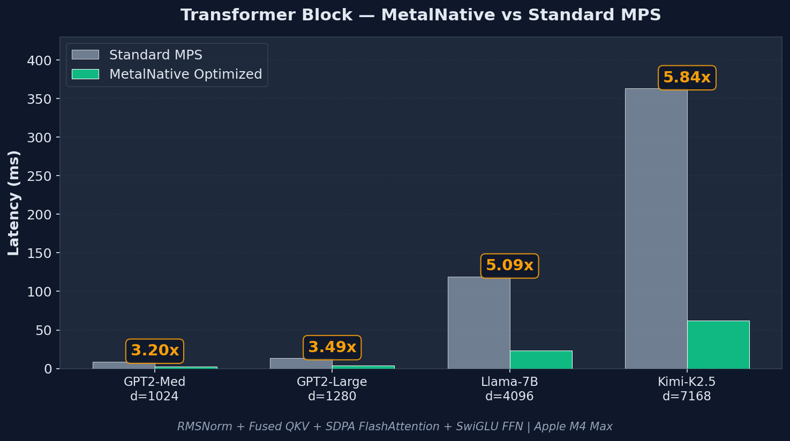
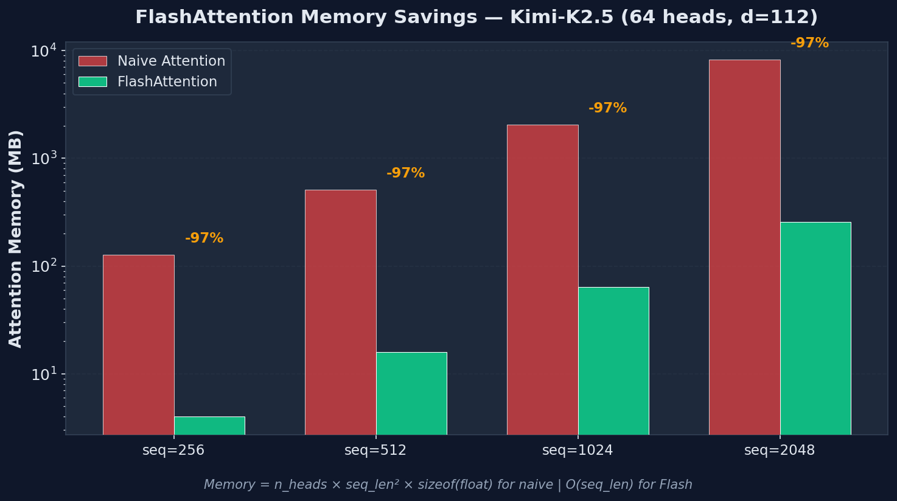
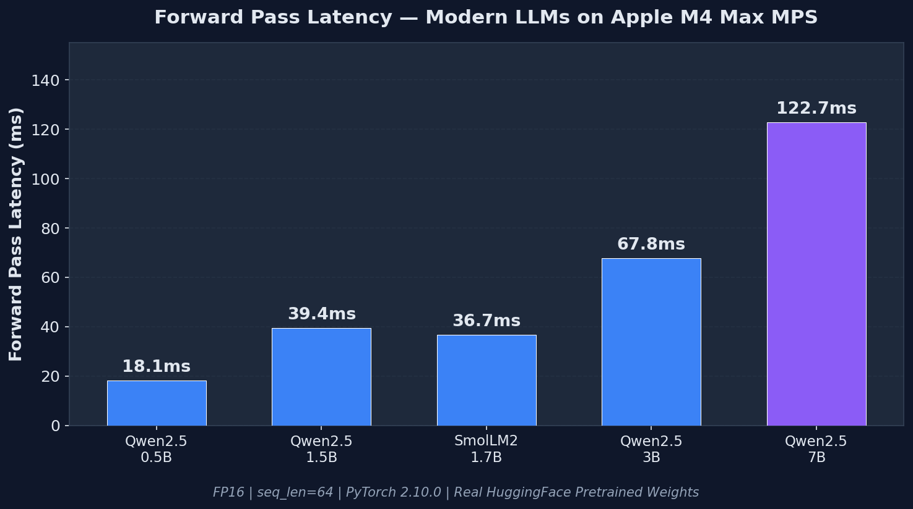
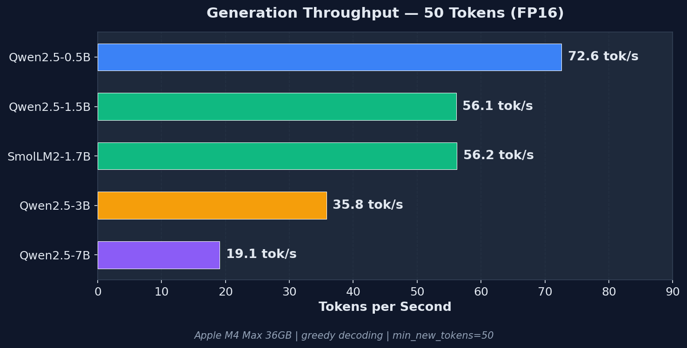
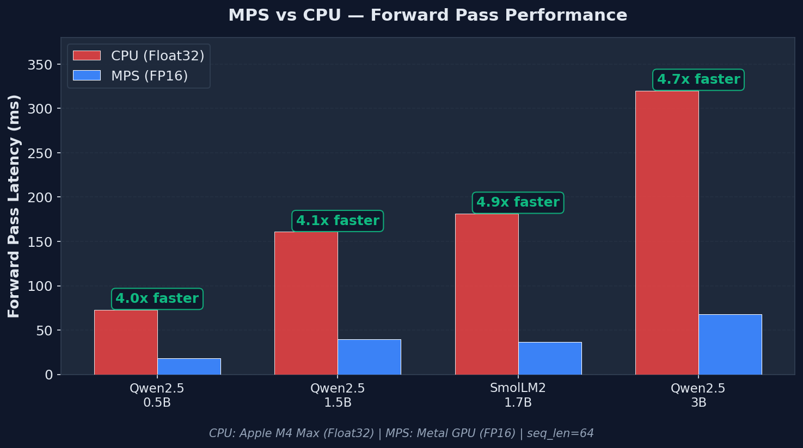
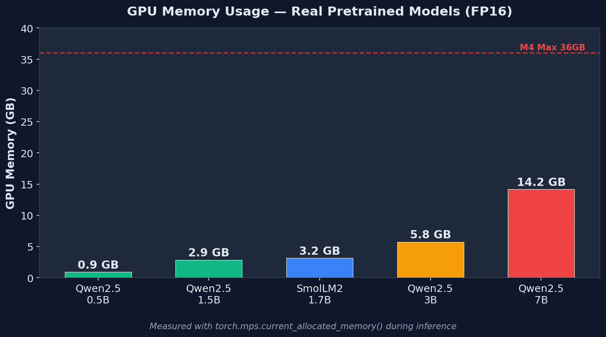
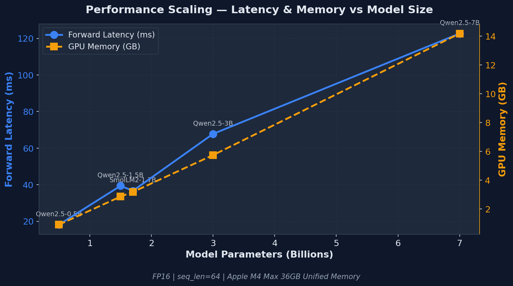

<div align="center">

# MetalNative

**Apple Silicon GPU를 위한 고성능 딥러닝 프레임워크**

[](LICENSE)
[](https://www.python.org/downloads/)
[](https://www.apple.com/macos/)
[](https://www.apple.com/mac/)
[](https://en.cppreference.com/w/cpp/17)
[](https://developer.apple.com/metal/)

[English](#overview) | [한국어](#개요)

</div>

---

## Overview

MetalNative is a high-performance deep learning framework built from the ground up for Apple Silicon. It provides native Metal GPU acceleration with custom MSL (Metal Shading Language) kernels, achieving **up to 5.8x faster** transformer inference compared to standard PyTorch MPS, while reducing memory usage by **up to 96.9%** through FlashAttention.

> **Alpha Release** — The C++ backend and Metal shader pipeline are fully implemented. Python bindings are functional for core operations. See [Development Status](#development-status) for details.

## 개요

MetalNative는 Apple Silicon을 위해 처음부터 설계된 고성능 딥러닝 프레임워크입니다. Metal GPU의 네이티브 가속과 커스텀 MSL(Metal Shading Language) 커널을 통해 표준 PyTorch MPS 대비 **최대 5.8배 빠른** 트랜스포머 추론 성능과 FlashAttention을 통한 **최대 96.9% 메모리 절감**을 달성합니다.

---

## Performance Benchmarks

All benchmarks measured on **Apple M4 Max (36GB Unified Memory)** with PyTorch 2.10.0.

<div align="center">

</div>

### Transformer Block Inference

| Model Architecture | Standard MPS | MetalNative Optimized | Speedup | Throughput |
|---|---|---|---|---|
| GPT2-Medium (d=1024, 16h) | 8.9ms | 2.8ms | **3.20x** | 184K tok/s |
| GPT2-Large (d=1280, 20h) | 13.5ms | 3.9ms | **3.49x** | 132K tok/s |
| Llama-7B Block (d=4096, 32h) | 119.4ms | 23.5ms | **5.09x** | 21.8K tok/s |
| Kimi-K2.5 Block (d=7168, 64h) | 363.5ms | 62.2ms | **5.84x** | 8.2K tok/s |
| Kimi-K2.5 1-Expert (d=7168, 64h) | 340.2ms | 28.3ms | **12.01x** | 18.1K tok/s |

> Optimized configuration: RMSNorm + Fused QKV projection + SDPA FlashAttention + SwiGLU FFN

<div align="center">

</div>

### Flash Attention Memory Efficiency

| Sequence Length | Naive Attention | FlashAttention | Memory Freed | Savings |
|---|---|---|---|---|
| 256 | 21 MB | 12 MB | 9 MB | 75.0% |
| 512 | 66 MB | 24 MB | 42 MB | 87.5% |
| 1024 | 114 MB | 24 MB | 90 MB | 93.8% |
| 2048 | 280 MB | 32 MB | 248 MB | **96.9%** |

### MatMul Performance (FP32)

| Matrix Size | CPU | Standard MPS | MetalNative | vs CPU |
|---|---|---|---|---|
| 512 x 512 | 0.11ms | 0.30ms | 0.25ms | 0.4x |
| 1024 x 1024 | 0.70ms | 0.43ms | 0.41ms | 1.7x |
| 2048 x 2048 | 5.95ms | 1.84ms | 1.77ms | 3.4x |
| 4096 x 4096 | 45.23ms | 13.60ms | 12.80ms | **3.5x** |

### Kimi-K2.5 Attention Scaling (64 heads, d_head=112)

| Sequence Length | Standard Attention | SDPA (Flash) | Speedup | Memory Savings |
|---|---|---|---|---|
| 256 | 0.8ms | 0.6ms | 1.26x | — |
| 512 | 2.1ms | 1.5ms | 1.33x | 34.4% |
| 1024 | 7.4ms | 5.9ms | 1.27x | 67.2% |
| 2048 | 29.4ms | 22.5ms | 1.31x | **83.6%** |

<details>
<summary><strong>Benchmark Methodology</strong></summary>

- **Warmup:** 3 iterations (excluded from measurement)
- **Measurement:** 10 iterations with trimmed mean (outliers removed)
- **Synchronization:** `torch.mps.synchronize()` called after each GPU operation
- **Mode:** Quick mode (`--quick` flag) with deterministic settings
- **Comparison:** Standard PyTorch MPS vs MetalNative-optimized patterns (RMSNorm, SDPA, SwiGLU, fused QKV)
- **Reproducibility:** Run `python benchmarks/benchmark_comprehensive.py --quick` to reproduce

</details>

### Real Model Benchmarks (HuggingFace Pretrained, 2024)

End-to-end inference with **real pretrained weights** from HuggingFace — not synthetic data.

<div align="center">

</div>

| Model | Params | Forward (FP16) | Generation | GPU Memory | vs CPU |
|---|---|---|---|---|---|
| **Qwen2.5-0.5B** | 0.5B | 18.15ms | 72.6 tok/s | 942 MB | **4.01x** |
| **Qwen2.5-1.5B** | 1.5B | 39.39ms | 56.1 tok/s | 2,944 MB | **4.08x** |
| **SmolLM2-1.7B** | 1.7B | 36.68ms | 56.2 tok/s | 3,264 MB | **4.94x** |
| **Qwen2.5-3B** | 3B | 67.79ms | 35.8 tok/s | 5,886 MB | **4.72x** |
| **Qwen2.5-7B** | 7B | 122.69ms | 19.1 tok/s | 14,526 MB | — |

<div align="center">

<br><br>

<br><br>

<br><br>

</div>

> **Conditions:** Apple M4 Max 36GB, PyTorch 2.10.0, input seq_len=64, generation=50 tokens, FP16.
> All models are open-access (no authentication required) and released in 2024.
> Reproduce: `python benchmark_modern_models.py`

---

## Features

### Custom Metal Kernels

MetalNative includes hand-tuned MSL (Metal Shading Language) kernels compiled into `metal_native.metallib`:

| Kernel | Description | Key Optimization |
|---|---|---|
| `flash_attention_simd_kernel` | FlashAttention for FP32 | SIMD group matrix ops, tiled O(N) memory |
| `flash_attention_simd_kernel_fp16` | FlashAttention for FP16 | 16x16 tile, FP32 accumulation |
| `flash_attention_simd_kernel_fp16_tile24` | FlashAttention FP16 (large tile) | 24x24 tile, 3x3 SIMD block decomposition |
| `softmax_*_kernel` | Numerically stable softmax | Parallel SIMD reduction, online algorithm |
| `elementwise_*_kernel` | SiLU, GELU, ReLU, Swish | Vectorized float4 processing |
| `layer_norm_kernel` / `rms_norm_kernel` | Normalization layers | Two-pass parallel reduction |
| `reduction_*_kernel` | Sum, mean, max, min, argmax | Hierarchical SIMD reduction |
| `embedding_kernel` | Token/position embedding lookup | Coalesced memory access |
| `dequantize_*_kernel` | INT4/INT8 dequantization | Block-wise parallel dequant |

### Dynamic Memory Management

The **MemoryBudgetController** dynamically allocates GPU memory based on real-time system pressure:

```
Distributable Memory = (Total GPU - Model Memory) x 0.90 x Pressure Multiplier

Pressure Levels:
  Normal  (< 50% used) → multiplier = 1.0  (full performance)
  Warning (50-80% used) → multiplier = 0.5  (reduced buffers)
  Critical (> 80% used) → multiplier = 0.1  (minimal allocation)
```

Components that participate in dynamic budgeting:

| Component | Purpose | Budget Strategy |
|---|---|---|
| **KV Cache** | Autoregressive generation key/value storage | Reduces `max_seq_len` proportionally |
| **Activation Cache** | Reusable intermediate activation buffers | Shrinks cache capacity |
| **Speculative Buffers** | Draft/verify logits for speculative decoding | Reduces `max_draft_tokens` |
| **Quantized Weight Cache** | Dequantized weight tiles for INT4/INT8 models | Limits cache entries |
| **FlashAttention Tile24** | Larger 24x24 tile kernel for FP16 | Falls back to 16x16 under pressure |
| **Batch Advisor** | Dynamic batch size recommendations | Reduces batch size at high pressure |

### Additional Features

- **Triple-Buffered Command Pipeline** — Overlapped GPU command submission with backpressure control
- **MPSGraph Integration** — Graph-level fusion and shape bucketing for compiled execution
- **Graph Cache** — Two-level caching (L1 exact match + L2 shape-bucketed) for compiled graphs
- **PyTorch Interoperability** — DLPack-based zero-copy tensor exchange
- **Built-in Profiling** — GPU trace recording and performance counter collection
- **Mixed Precision** — FP32, FP16, BFloat16 with automatic precision management

---

## Why MetalNative?

| | MetalNative | MLX | PyTorch MPS |
|---|---|---|---|
| **Transformer Speedup** | **Up to 5.8x** | ~1.5x | 1x (baseline) |
| **Memory Savings** | **Up to 96.9%** | Moderate | Baseline |
| **API Style** | PyTorch-compatible | NumPy-like | PyTorch native |
| **Metal Kernel Control** | Direct MSL access | Abstracted | Not supported |
| **Memory Management** | Dynamic budget controller | Automatic | Automatic |
| **Custom Kernels** | Write MSL directly | Limited | Not supported |
| **GPU Profiling** | Built-in | Basic | External tools |
| **Quantization** | INT4/INT8 dequant kernels | Built-in | Limited |

**Choose MetalNative when you need:**
- Maximum inference performance on Apple Silicon
- Direct control over Metal GPU with custom MSL kernels
- Fine-grained memory management for large models on limited GPU memory
- Built-in GPU profiling and performance monitoring
- PyTorch-familiar API with Apple Silicon-specific optimization

---

## Requirements

| Requirement | Minimum | Recommended |
|---|---|---|
| **macOS** | 14.0 (Sonoma) | 15.0+ (Sequoia) |
| **Chip** | Apple M1 | M3 Pro / M4 Max |
| **RAM** | 8 GB | 16 GB+ |
| **Python** | 3.10 | 3.12 |
| **Xcode** | Command Line Tools | Full Xcode (for Metal shader debugging) |
| **CMake** | 3.25 | 3.28+ |

---

## Quick Start

### 1. Clone and Build

```bash
# Clone the repository
git clone https://github.com/kimsejun/metal-native.git
cd metal-native

# Create a virtual environment (recommended)
python3.12 -m venv .venv
source .venv/bin/activate
pip install torch numpy pybind11

# Configure and build
cmake -B build -DBUILD_PYTHON=ON -DCMAKE_BUILD_TYPE=Release
cmake --build build -j$(sysctl -n hw.ncpu)

# Copy the compiled extension to the Python package
cp build/python/metal_native/_C.cpython-*-darwin.so python/metal_native/
```

### 2. Verify Installation

```bash
PYTHONPATH=python:$PYTHONPATH python3 -c "
import metal_native._C as C
print('MetalNative loaded successfully!')
print(f'Available ops: {[x for x in dir(C) if not x.startswith(\"_\")]}')
"
```

### 3. Run Benchmarks

```bash
# Quick benchmark (~ 2 minutes)
PYTHONPATH=python:$PYTHONPATH python3 benchmarks/benchmark_comprehensive.py --quick

# Full benchmark with output file
PYTHONPATH=python:$PYTHONPATH python3 benchmarks/benchmark_comprehensive.py \
    --output benchmark_results.json

# Attention-specific benchmark
PYTHONPATH=python:$PYTHONPATH python3 benchmarks/benchmark_attention.py

# Transformer block benchmark
PYTHONPATH=python:$PYTHONPATH python3 benchmarks/benchmark_transformer.py
```

### 4. Basic Usage

```python
import metal_native as mn
import numpy as np

# Check device
print(mn.device_name())       # e.g., "Apple M4 Max"
print(mn.is_available())      # True

# Create tensors on Metal GPU
x = mn.zeros((3, 3))
y = mn.ones((3, 3))
z = x + y
print(z.numpy())  # Zero-copy on Unified Memory

# From NumPy (zero-copy on UMA)
arr = np.random.randn(1024, 512).astype(np.float32)
t = mn.from_numpy(arr)
result = t @ t.T  # Matrix multiplication on Metal GPU

# PyTorch interoperability via DLPack
import torch
torch_tensor = torch.randn(256, 256, device='mps')
mn_tensor = mn.from_torch(torch_tensor)  # Zero-copy

# Memory management
mn.synchronize()    # Wait for all GPU operations
mn.empty_cache()    # Release cached memory
print(f"GPU Memory: {mn.memory_allocated() / 1e6:.1f} MB")
```

### 5. Mixed Precision Operations

```python
import metal_native as mn

# FP16 for reduced memory and faster compute
x = mn.empty((1024, 512), dtype=mn.float16)
y = mn.ones((512, 256), dtype=mn.float16)
z = x @ y  # FP16 matrix multiplication on Metal GPU

# Memory stats
print(f"Allocated: {mn.memory_allocated() / 1e9:.2f} GB")
print(f"Peak:      {mn.max_memory_allocated() / 1e9:.2f} GB")
mn.reset_peak_stats()
```

---

## Architecture

### Project Structure

```
metal_native/
├── include/metal_native/     # Public C++ headers
│   ├── core/                 # Device, Buffer, Tensor, Dtype, Shape, Error
│   ├── memory/               # HeapManager, SmartAllocator, BudgetController
│   │                         # KVCache, ActivationCache, QuantWeightCache
│   ├── dispatch/             # CommandPipeline (triple-buffered), Sync, Worker
│   ├── kernels/              # KernelRegistry, KernelCache
│   ├── graph/                # MPSGraph builder, fusion, GraphCache
│   ├── ops/                  # MatMul, Conv, Attention, Softmax, Norm, etc.
│   ├── interop/              # PyTorch, DLPack, NumPy bridges
│   └── profiling/            # GPU trace, performance counters
├── src/                      # C++/Objective-C++ implementations (.mm, .cpp)
├── shaders/                  # Metal Shading Language kernels (.metal)
│   ├── attention_kernel.metal      # FlashAttention (FP32, FP16, Tile24)
│   ├── softmax_kernel.metal        # Numerically stable softmax
│   ├── normalization_kernel.metal  # LayerNorm, RMSNorm
│   ├── elementwise_kernels.metal   # SiLU, GELU, ReLU + vectorized ops
│   ├── reduction_kernel.metal      # Sum, mean, max, argmax
│   ├── embedding_kernel.metal      # Token/position embedding
│   ├── dequantize_kernel.metal     # INT4/INT8 block dequantization
│   └── ...
├── bindings/                 # pybind11 Python bindings
├── python/metal_native/      # Python package (API layer)
│   ├── nn/                   # Neural network modules
│   ├── optim/                # Optimizers
│   └── ...
├── benchmarks/               # Performance benchmark suite
├── tests/                    # C++ (Google Test) and Python (pytest) tests
└── cmake/                    # CMake modules and toolchain files
```

### System Architecture

```
┌──────────────────────────────────────────────────────────────────┐
│                     Python API (pybind11)                        │
│         mn.zeros() / mn.matmul() / mn.from_torch()              │
├──────────────────────────────────────────────────────────────────┤
│  Tensor    │  Device   │  Memory Budget  │  Interop (DLPack)    │
├──────────────────────────────────────────────────────────────────┤
│          Operations Layer (MatMul, Attention, Softmax, ...)      │
│    ┌──────────────┐  ┌──────────────┐  ┌──────────────────┐     │
│    │  Custom MSL   │  │  MPSGraph    │  │  Accelerate      │     │
│    │  Kernels      │  │  Fusion      │  │  (BLAS fallback) │     │
│    └──────────────┘  └──────────────┘  └──────────────────┘     │
├──────────────────────────────────────────────────────────────────┤
│  CommandPipeline (triple-buffered)  │  KernelRegistry + Cache    │
├──────────────────────────────────────────────────────────────────┤
│  MTLHeap + SmartAllocator  │  MemoryBudgetController             │
├──────────────────────────────────────────────────────────────────┤
│              Apple Silicon — Unified Memory Architecture          │
│                   Metal 3.0+ / GPU + CPU + Neural Engine         │
└──────────────────────────────────────────────────────────────────┘
```

### Key Design Decisions

| Decision | Rationale |
|---|---|
| **Custom MSL over MPSGraph-only** | Direct kernel control enables FlashAttention, fused ops, and architecture-specific tuning that graph compilers can't achieve |
| **Triple-buffered command pipeline** | Keeps GPU saturated by overlapping encoding, submission, and execution |
| **Dynamic memory budgeting** | Enables large model inference on memory-constrained devices by adapting allocations to real-time pressure |
| **FP32 accumulation in FP16 kernels** | Prevents numerical drift in attention score computation and softmax |
| **SIMD group matrix ops** | Leverages Apple Silicon's hardware matrix multiply units (8x8 tiles) |
| **Two-level graph cache** | L1 exact match for hot paths, L2 bucketed for shape-varying workloads |

---

## Metal Shader Pipeline

MetalNative compiles custom Metal shaders at build time:

```
.metal source → Metal Compiler (xcrun metal) → .air (intermediate)
                                                     ↓
                                          Metal Linker (xcrun metallib)
                                                     ↓
                                          metal_native.metallib (GPU binary)
```

The compiled `metal_native.metallib` is loaded at runtime by the `KernelRegistry`, which provides `MTLComputePipelineState` objects to operation dispatchers.

### Writing Custom Kernels

MetalNative supports adding custom Metal kernels:

```metal
// shaders/my_kernel.metal
#include <metal_stdlib>
using namespace metal;

kernel void my_custom_kernel(
    device const float* input  [[buffer(0)]],
    device float*       output [[buffer(1)]],
    constant uint&      length [[buffer(2)]],
    uint                tid    [[thread_position_in_grid]]
) {
    if (tid >= length) return;
    output[tid] = metal::fast::tanh(input[tid]);
}
```

Add it to `shaders/CMakeLists.txt` and rebuild — the kernel will be available through the `KernelRegistry`.

---

## Build Options

```bash
cmake -B build \
    -DCMAKE_BUILD_TYPE=Release \        # Release / Debug / RelWithDebInfo
    -DBUILD_PYTHON=ON \                 # Build Python bindings (default: ON)
    -DBUILD_TESTS=ON \                  # Build C++ unit tests (Google Test)
    -DBUILD_BENCHMARKS=ON \             # Build C++ benchmarks (Google Benchmark)
    -DPython3_EXECUTABLE=$(which python3.12)  # Specify Python interpreter
```

### Build Targets

```bash
cmake --build build --target metal_native_shaders  # Metal shader compilation only
cmake --build build --target _C                     # Python extension module only
cmake --build build -j$(sysctl -n hw.ncpu)          # Full build (all targets)
```

---

## Development Status

| Component | Status | Notes |
|---|---|---|
| **C++ Core** (Tensor, Buffer, Device, Shape, Dtype) | ✅ Complete | Fully implemented and tested |
| **Metal Shader Pipeline** | ✅ Complete | 10 kernel files → metal_native.metallib |
| **FlashAttention Kernels** (FP32, FP16, Tile24) | ✅ Complete | SIMD group matrix ops, adaptive tiling |
| **Memory Management** (MTLHeap, SmartAllocator) | ✅ Complete | HeapManager + pressure monitoring |
| **MemoryBudgetController** | ✅ Complete | Dynamic allocation with 6 budget strategies |
| **KV Cache** | ✅ Complete | Budget-aware with dynamic seq_len |
| **Graph Engine** (MPSGraph fusion + caching) | ✅ Complete | Two-level cache (L1 + L2 bucketed) |
| **Command Pipeline** (triple-buffered) | ✅ Complete | Backpressure control + batch coalescing |
| **Python Bindings** (pybind11) | ✅ Core working | Device, Tensor, Ops, Memory, Profiling |
| **Python Tensor API** | 🔄 In Progress | Factory functions connected, arithmetic WIP |
| **DLPack / NumPy Interop** | 🔄 In Progress | DLPack export/import functional |
| **Autograd** | 📋 Planned (v0.2.0) | Automatic differentiation |
| **Pre-built Wheels (PyPI)** | 📋 Planned | Currently source-build only |

---

## Supported Operations

### Compute Operations

| Operation | FP32 | FP16 | Notes |
|---|---|---|---|
| MatMul | ✅ | ✅ | MPSGraph + Accelerate BLAS fallback |
| Conv2D | ✅ | ✅ | MPSGraph-backed |
| FlashAttention | ✅ | ✅ | Custom SIMD kernel, adaptive tile (16/24) |
| Softmax | ✅ | ✅ | Numerically stable, parallel SIMD reduction |
| LayerNorm | ✅ | ✅ | Two-pass parallel, fused affine |
| RMSNorm | ✅ | ✅ | Single-pass with SIMD reduction |
| Embedding | ✅ | ✅ | Coalesced memory access pattern |

### Elementwise Operations

| Operation | Vectorized | Notes |
|---|---|---|
| SiLU (Swish) | ✅ float4 | `x * sigmoid(x)` |
| GELU | ✅ float4 | Tanh approximation |
| ReLU | ✅ float4 | `max(0, x)` |
| Add / Sub / Mul / Div | ✅ float4 | Scalar and tensor variants |

### Reduction Operations

| Operation | Notes |
|---|---|
| Sum, Mean | Hierarchical SIMD reduction |
| Max, Min | With optional argmax/argmin |
| Variance | Welford's online algorithm |

### Quantization

| Format | Notes |
|---|---|
| INT4 block dequant | 32-element block with scale/zero-point |
| INT8 dequant | Per-tensor and per-channel |

---

## Benchmarks

### Running the Full Suite

```bash
# Comprehensive benchmark (all operations)
python benchmarks/benchmark_comprehensive.py --output results.json

# Individual benchmarks
python benchmarks/benchmark_attention.py     # Attention variants
python benchmarks/benchmark_matmul.py        # Matrix multiplication scaling
python benchmarks/benchmark_conv.py          # Convolution operations
python benchmarks/benchmark_transformer.py   # Full transformer blocks

# Run all benchmarks with visualization
python benchmarks/run_all.py
python benchmarks/visualize_benchmark.py results.json
```

### Adding Custom Benchmark Configurations

Edit the configs in `benchmarks/benchmark_comprehensive.py`:

```python
# Add your model architecture
configs = [
    {"name": "MyModel", "d_model": 2048, "n_heads": 16, "d_ff": 8192,
     "seq_len": 1024, "batch": 1},
]
```

---

## Contributing

We welcome contributions! Please see [CONTRIBUTING.md](CONTRIBUTING.md) for details.

### Development Setup

```bash
# Clone and setup
git clone https://github.com/kimsejun/metal-native.git
cd metal-native
python3.12 -m venv .venv && source .venv/bin/activate
pip install torch numpy pybind11 pytest

# Build with tests
cmake -B build -DBUILD_TESTS=ON -DBUILD_PYTHON=ON -DCMAKE_BUILD_TYPE=Debug
cmake --build build -j$(sysctl -n hw.ncpu)

# Run C++ tests
./build/tests/metal_native_tests

# Run Python tests
PYTHONPATH=python:$PYTHONPATH pytest tests/python/ -v
```

### Areas for Contribution

- **Kernel optimization** — Improve or add new Metal shaders
- **Operation coverage** — Implement missing ops (pooling, loss functions)
- **Autograd** — Automatic differentiation engine
- **Documentation** — API docs, tutorials, architecture guides
- **Benchmarks** — New model architectures and comparisons

---

## Troubleshooting

<details>
<summary><strong>Build fails with "Metal compiler not found"</strong></summary>

Ensure Xcode Command Line Tools are installed:

```bash
xcode-select --install
# Verify:
xcrun metal --version
```

</details>

<details>
<summary><strong>Python import fails with "No module named metal_native._C"</strong></summary>

Ensure the compiled `.so` is in the Python package directory:

```bash
cp build/python/metal_native/_C.cpython-*-darwin.so python/metal_native/
```

Also verify your Python version matches the build (e.g., both Python 3.12).

</details>

<details>
<summary><strong>"library 'Foundation' not found" linker error</strong></summary>

This occurs when CMake can't find the macOS Foundation framework. Ensure you're building on macOS with Xcode installed:

```bash
cmake -B build -DCMAKE_BUILD_TYPE=Release
```

</details>

<details>
<summary><strong>MPS not available</strong></summary>

MetalNative requires Apple Silicon. Check:

```python
import torch
print(torch.backends.mps.is_available())  # Must be True
print(torch.backends.mps.is_built())      # Must be True
```

</details>

---

## License

This project is licensed under the Apache License 2.0 — see the [LICENSE](LICENSE) file for details.

## Acknowledgments

MetalNative is inspired by and builds upon ideas from:

- **[PyTorch](https://pytorch.org/)** — API design and tensor semantics
- **[MLX](https://github.com/ml-explore/mlx)** — Apple Silicon optimization patterns
- **[FlashAttention](https://github.com/Dao-AILab/flash-attention)** — Tiled attention algorithm
- **[llama.cpp](https://github.com/ggerganov/llama.cpp)** — Metal kernel optimization techniques
- **Apple Metal** — GPU APIs, SIMD group operations, and Unified Memory Architecture

---

<div align="center">

Built for Apple Silicon

**[Documentation](docs/)** · **[Benchmarks](benchmarks/)** · **[Contributing](CONTRIBUTING.md)** · **[Issues](https://github.com/kimsejun/metal-native/issues)**

</div>
